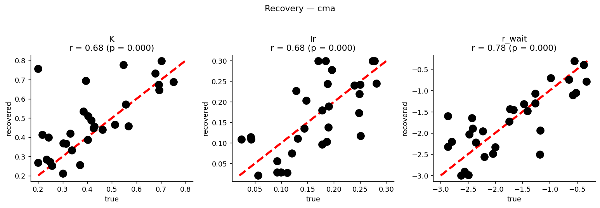

# Code_RLSS

Code supporting:

> Esmaily, J., Moran, R., Roudi, Y., & Bahrami, B. (2026). *A Model-Free Reinforcement
> Learning Implementation of Decision Making Under Uncertainty by Sequential Sampling.*
> **Neural Computation.** doi:[10.1162/neco.a.1543](https://doi.org/10.1162/neco.a.1543)

The model is an **RL-DDM**: a drift-diffusion decision process whose decision
threshold is *learned* through reinforcement learning rather than fixed in advance. On each
trial the agent accumulates noisy sensory evidence step by step ("wait"), updates a Q-table
by temporal-difference learning, and commits to a left/right choice; the speed–accuracy
trade-off emerges from learning.

The repo contains two independent pipelines:

- **A. Simulation** — train the model and reproduce the main behavioural figures.
- **B. Parameter recovery** — show the model's parameters can be recovered from behaviour
  (the identifiability check).

---

## Files

| File | Pipeline | Purpose |
|------|----------|---------|
| `utils.py` | A | Model parameters, the trial sequence, and core functions (`TakeAction`, `softmax`, smoothing). Edit this to change the simulation. |
| `Basic_Model.py` | A | Runs the simulation using the params in `utils.py`. Writes `SavedData/ModelSim.pkl`. |
| `Plot_Basic_Model.py` | A | Reads `ModelSim.pkl` and produces the figures (Q-tables, chronometric/psychometric curves, threshold evolution, example trajectories). |
| `SimpleRecovery.py` | B | Parameter-recovery pipeline: simulate behaviour from known parameters, refit, and store true vs. recovered. Writes `SavedData/Recovery_<method>.pkl`. |
| `PlotRecovery.py` | B | Plots recovery results: recovered-vs-true scatter (with Pearson *r*) and the cross-correlation matrix. |

---

## Requirements

- Python 3 (tested on 3.14).
- Packages: `numpy`, `scipy`, `matplotlib`, `seaborn` (pipeline A), and `cma` (pipeline B;
  default optimizer). Optional: `scikit-optimize` for the `gp` optimizer.

```bash
pip install numpy scipy matplotlib seaborn cma scikit-optimize
```

A directory named **`SavedData/`** must exist in the repo root — both pipelines read and
write their `.pkl` files there.

---

## A. Simulation pipeline

1. Set the parameters you want in **`utils.py`** (learning rate `lr`, drift coeff `K`,
   softmax temperature `beta`, rewards, number of trials/iterations, etc.).
2. Run the simulation:
   ```bash
   python Basic_Model.py        # -> SavedData/ModelSim.pkl
   ```
3. Plot the results:
   ```bash
   python Plot_Basic_Model.py   # reads SavedData/ModelSim.pkl
   ```

The same saved file reproduces the figures shown in the manuscript.

---

## B. Parameter-recovery pipeline

Establishes that there is **no identifiability problem** among the fitted parameters —
the prerequisite for interpreting `r_wait` (cost of waiting) as a per-subject marker.

- **Fitted:** `K` (drift scaling), `lr` (learning rate), `r_wait` (cost of waiting).
- **Fixed:** `σ` (diffusion noise — standard DDM scaling convention) and `β` (softmax
  temperature — behaviour saturates above β≈10, so it is structurally unidentifiable for this task).
- **Optimizer:** CMA-ES by default (`METHOD = "cma"`; robust to noisy behavioural
  objectives). Alternatives: `"anneal"` (`scipy.dual_annealing`, no extra deps) and `"gp"`
  (`scikit-optimize`). Set `METHOD` at the top of `SimpleRecovery.py`.

```bash
python SimpleRecovery.py        # -> SavedData/Recovery_cma.pkl  (slow: 30 fits)
python PlotRecovery.py cma      # scatter + correlation matrix; prints Pearson r
```

`PlotRecovery.py` takes the method as an argument (`cma` | `anneal` | `gp`, default `cma`)
and reads `SavedData/Recovery_<method>.pkl`. The shipped `Recovery_cma.pkl` is already in
`SavedData/`, so `python PlotRecovery.py cma` works out of the box.

Latest results (CMA-ES, N = 30): `K` r = 0.68, `lr` r = 0.68, `r_wait` r = 0.78, with all
cross-correlations small (|r| ≤ 0.35) — no parameter trade-off.

**Recovered vs. true** (identity line + Pearson *r*):



---

## Citation

If you use this code, please cite:

```bibtex
@article{Esmaily2026RLSS,
  title   = {A Model-Free Reinforcement Learning Implementation of Decision Making
             Under Uncertainty by Sequential Sampling},
  author  = {Esmaily, Jamal and Moran, Rani and Roudi, Yasser and Bahrami, Bahador},
  journal = {Neural Computation},
  year    = {2026},
  doi     = {10.1162/neco.a.1543}
}
```

For any questions or ambiguity please contact **Jamal Esmaily** — *jimi.esmaily@gmail.com*.
